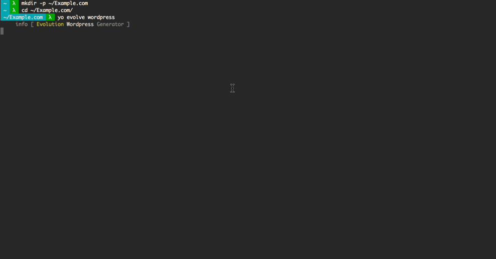

# Evolution WordPress

[](https://travis-ci.org/evolution/wordpress)
[](https://david-dm.org/evolution/wordpress)
[](https://david-dm.org/evolution/wordpress#info=devDependencies&view=table)

> Rapidly create, develop, & deploy WordPress across multiple environments.
> 

Evolution lets you generate an entirely versioned, multi-environment Wordpress site in under a minute!

### Features

* Built on Ubuntu Linux 14.04
* [Vagrant](https://www.vagrantup.com/) server for local development
* Automated [Ansible](http://www.ansible.com/) provisioning
* Automated [Capistrano](http://capistranorb.com/) deployment
* Passwordless login over SSH
* Secure HTTPS encryption
* Server-side [Varnish](https://www.varnish-cache.org/) caching
* Preconfigured [iptables](http://www.netfilter.org/projects/iptables/) firewall
* Performance tuned [Apache](http://httpd.apache.org/) webserver
* [Postfix](http://www.postfix.org/) mail server


## Quick Start

Evolution is intended for use in a POSIX environment, such as Linux or Mac OS. Windows is not officially supported, but _may_ be possible with a POSIX subsystem like [Cygwin](https://www.cygwin.com/).

### Pre-requisites

You will need:

* [Vagrant](https://www.vagrantup.com/downloads.html) 1.1+
* [Hostmanager for Vagrant](https://github.com/smdahlen/vagrant-hostmanager#installation)
* [npm](https://docs.npmjs.com/getting-started/installing-node)
* [Bundler](http://bundler.io/)
* [Ansible](http://docs.ansible.com/intro_installation.html) 1.6+
* [sshpass](https://gist.github.com/arunoda/7790979)

You can then use npm to install Bower and the Yeoman generator:

```
npm install -g bower yo generator-evolve
```

### Generating a project

Create a directory for your new project, invoke the generator from said directory, and then follow the prompts:

```
mkdir -p ~/Example.com
cd ~/Example.com/
yo evolve wordpress
```

### What does multi-environment mean?

Each evolution project has three distinct "stages", or environments:

* local - where all your development happens
* staging - qa and feature review
* production - polished end product


### Starting the local environment

In your newly generated project, bring up the vagrant machine. This will probably prompt for a password, and may take several minutes to complete:

```
vagrant up
```

Now, you can SSH into the local server:

```
vagrant ssh
```

As well as view the local site in your web browser -- following our example, it would be:

> http://local.example.com/

### Building a remote environment

For your remote environment, you will need:

* A web accessible server running Ubuntu 14.04
* A DNS or hostfile entry for said server, resolving to (in our example) `staging.example.com`
* An SSH user on said server, with password login and sudo priveledges
* A recent version of git on the server (see below)

You can confirm the above is working by opening a terminal to the remote machine, and installing git:

```
ssh jdoe@example.com
sudo apt-get install git
```

You will also need to:

* Version your new project with git
* Push it to a web accessible remote, such as [Github](https://github.com/) or [Gitlab](https://gitlab.com/)
* Configure your project's SSH key (in `lib/ansible/files/ssh/`) as a deployment key.
  * [Github - Managing Deploy Keys](https://developer.github.com/guides/managing-deploy-keys/)
  * [Gitlab - Deploy keys](http://doc.gitlab.com/ce/ssh/README.html#deploy-keys)

Next, you will provision the remote server. You should be prompted for the username above and the corresponding password:

```
bundle exec cap staging evolve:provision
```

Now, you will deploy your project to the server:

```
bundle exec cap staging deploy
```

You should now be able to reach the remote environment in your web browser:

> http://staging.example.com/

You'll notice that your remote environment is probably showing you the Wordpress setup page. You can push your local database and uploaded files to the remote environment:

```
bundle exec cap staging evolve:up
```

It's similarly easy to pull your remote database and files to the local environment:

```
bundle exec cap staging evolve:down
```

## Managing Remote Environments

Evolution exposes several commands via Capistrano for managing and supporting your remote environments.

As mentioned earlier, you can sync the database and uploaded files all at once...as well as separately:

```
bundle exec cap staging evolve:up:db
bundle exec cap staging evolve:up:files
```

You can SSH directly to the remote server, without username or password prompts:

```
bundle exec cap staging evolve:ssh
```

You can remotely stop and start services, or even reboot the server:

```
bundle exec cap staging evolve:stop
bundle exec cap staging evolve:restart
bundle exec cap staging evolve:status
bundle exec cap staging evolve:reboot
```

You can even remotely view logs:

```
bundle exec cap staging evolve:logs:apache:access
bundle exec cap staging evolve:logs:apache:error
bundle exec cap staging evolve:logs:varnish
bundle exec cap staging evolve:logs:pound
bundle exec cap staging evolve:logs:evolution
```

These and more can be found in the [Evolution tasks directory](https://github.com/evolution/wordpress/tree/master/lib/capistrano/tasks).