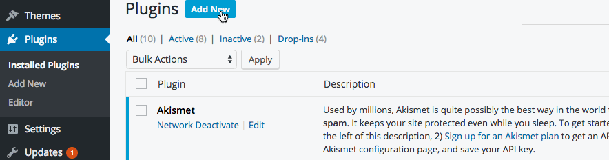
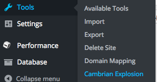

# Importing a non Evolution site

### Out with the old

From your existing wordpress site (must be 3.0 or higher), you'll need to install [the latest release](https://github.com/evolution/wordpress-plugin-cambrian/releases/latest) of the **Cambrian Explosion** plugin. For convenience, `cambrian.zip` is pre-packaged to drop right into the Wordpress admin.

You'll also need to activate the plugin (for multisite, you should activate from whichever subsite you'll be exporting). There should now be a new item under the _Tools_ menu.

Click the button and you should be presented with some output and eventually an export zip file.

### The blank slate

You'll need to [follow the guide](./TUTORIAL-NEW.md) for generating a new site, but **stop once you reach the Wordpress install page** &mdash; any configuration will come after the import process.

### In with the new

Run the import script in your newly generated site, provide the path to the export file when prompted, and follow any further prompts.

	./bin/import

Once complete, open your local site in the browser, which should have all the content, themes, and plugins from your old site.

##### Sidenote: Tidying up
> Some activation, reconfiguration, and cleanup may be necessary depending on your existing plugins and themes.

### What now?

From here, you can continue to
[follow the guide](./TUTORIAL-NEW.md#useful-tools-for-all-stages) for preparing and deploying to remote environments.