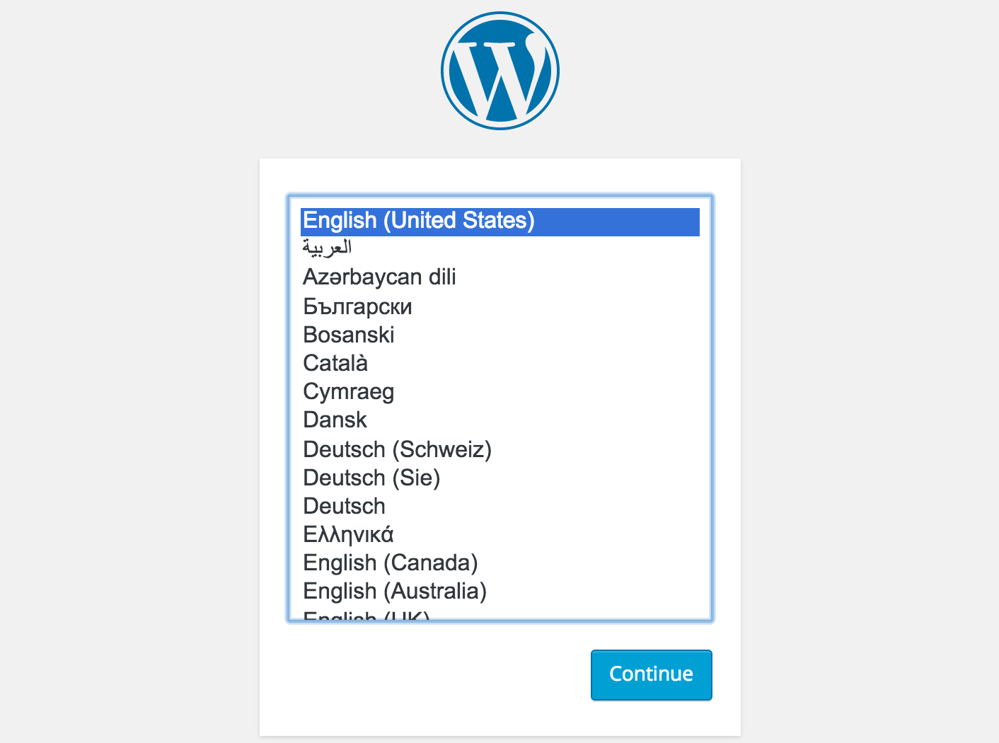

# Generating a new site

### First things first...

Ensure that you've installed all [prerequisites](../README.md#pre-requisites) (including the Evolve generator).

### Let's create something!

Create and change to a directory for your Evolution site, and initialize it as a new git repository:

	mkdir ~/Example.com
	cd ~/Example.com
	git init

Run the yeoman generator in said directory and follow [the prompts](./REF-generator-prompts.md):

	yo evolve wordpress

##### Sidenote: Public versus private

> The difference between [public and private projects](./REF-generator-prompts.md#private-or-public) is important, and will affect where and how you version your project.

Add and commit your pristine generated site:

	git add .
	git commit -m "Newly generated Example.com"

Create a remote repository (eg, on [Github](https://help.github.com/articles/create-a-repo/) or [Gitlab](http://doc.gitlab.com/ce/gitlab-basics/create-project.html)), add it as a remote origin to your local repo, and push to it:

	git remote add origin git@yourremoteprovider.com:yourusername/Example.com.git
	git push origin master

### Managing your environments

Every Evolution site has three pre-configured "stages", environments with a specific purpose:

* **local** - where all of your development should happen, such as installing or editing themes and plugins
* **staging** - where quality assurance and review of new features should happen
* **production** - where your polished end product, the canonical "live site", should exist

### Getting to know your local environment...

Create a self-contained local environment for your site with vagrant. This may take several minutes to complete:

	vagrant up

This creates a virtual server with the entire Evolution web stack, and your site codebase pre-deployed. You can ssh into the server:

	vagrant ssh

As well as view the local site in your browser -- following our example, it would be:

> http://local.example.com/

On the first visit, you'll be presented with the Wordpress install page:

Follow the steps to configure your site. You should only need to do this once, and _only on the local stage_ -- access to the install page is disabled for staging and production. We'll come back to that in a bit.

### Useful tools for all stages

Evolution [provides several Capistrano tasks](./REF-cap-tasks.md) that you can run for a given stage:

	# tail the apache error logs in real time
	# (ctrl+c to stop)
	bundle exec cap local evolve:logs:apache:access
	
	# restart the web stack
	bundle exec cap local evolve:restart

### Preparing your remote environments

For your remote environment (staging in this case), you will need:

* a web accessible server running **Ubuntu 14.04**
* a DNS or hostfile entry for said server, resolving to (in our example) `staging.example.com`

For provisioning, you'll need a user on said server with password-based SSH access, and [sudo](https://en.wikipedia.org/wiki/Sudo) privilege.

Many web hosts will provide you a `root` user with a private key for remote access. We will demonstrate how to prepare such a server for Evolution.

##### Sidenote: Provisioning as root
> You may be asking, "My root user _has_ password-based SSH access. Can I provision as root?" To which the anser is yes, you absolutely can!
>
> That said, it is [pretty universally recommended](http://unix.stackexchange.com/questions/82626/why-is-root-login-via-ssh-so-bad-that-everyone-advises-to-disable-it#answer-82639) to _disable_ password-based root access to a server -- either by setting up an ssh keypair for the root user, or setting the `PermitRootLogin` option of your ssh daemon to `no`.

Log into the server (with your provided ssh key), and create a unique user and password with the [adduser](https://help.ubuntu.com/community/AddUsersHowto#Command-line) command:

	ssh -i ~/staging-key.pem root@staging.example.com
	adduser jdoe

You'll also need to grant this user sudo privilege. On Ubuntu, this is most easily accomplished by adding the user to `sudo` group:

	usermod -aG sudo jdoe

### Provisioning your remote environments

Evolution provides a capistrano task for provisioning your remote stage:

	bundle exec cap staging evolve:provision

When running this against a never before provisioned server, you should be prompted for a username, password, and sudo password (typically the exact same password):

	Unable to provision with SSH publickey for "deploy" user
	Please enter user to provision as (root):
	SSH password:
	sudo password [defaults to SSH password]:

What follows is Ansible provisioning, which (among other things) sets up private key access for the newly created **deploy** user.

### Plugging the provision hole

Any subsequent reprovisioning will use the **deploy** user, so it's a good idea at this point to remove or disable that `jdoe` user we added a couple steps back.

	# lock user account
	passwd -l jdoe
	
	# or remove user altogether
	deluser --remove-home jdoe

### Deploying and syncing up

We'll need to configure your project's SSH public key (in `lib/ansible/files/ssh/`) as a deployment key:
* [Github - Managing Deploy Keys](https://developer.github.com/guides/managing-deploy-keys/)
* [Gitlab - Deploy keys](http://doc.gitlab.com/ce/ssh/README.html#deploy-keys)

And then deploy with capistrano:

	bundle exec cap staging deploy

You should now be able to reach the remote environment in your web browser:

> http://staging.example.com/

You'll notice that your remote environment produces a [403 Forbidden](https://en.wikipedia.org/wiki/HTTP_403) error, because access to the Wordpress install page is disabled for security concerns.

Sync your local database and uploaded files up to the remote environment, and restart it (to clear the varnish cache):

	bundle exec cap staging evolve:up
	bundle exec cap staging evolve:restart

You'll be prompted that this is a destructive operation and will overwrite any existing db and files on the remote server:

	WARNING: You are about to destroy & override the "staging" database!
	WARNING: You are about to overwrite "staging" files!

Try your browser again, and it should mirror your local environment.

##### Sidenote: Syncing down

> Syncing a remote database and files down to the local environment is similarly straightforward:
>
 	bundle exec cap staging evolve:down
 	bundle exec cap local evolve:restart
> Note that we're restarting local, because the previous command is overwriting the local database/files.

### What now?

As you continue to develop your site, you'll want to commit and push future changes (including adding themes and plugins) to your git remote. Sending newly committed changes to your remote needs only another deployment.

As you add content and uploaded files in Wordpress itself, you can send it to your remote with another sync up.
